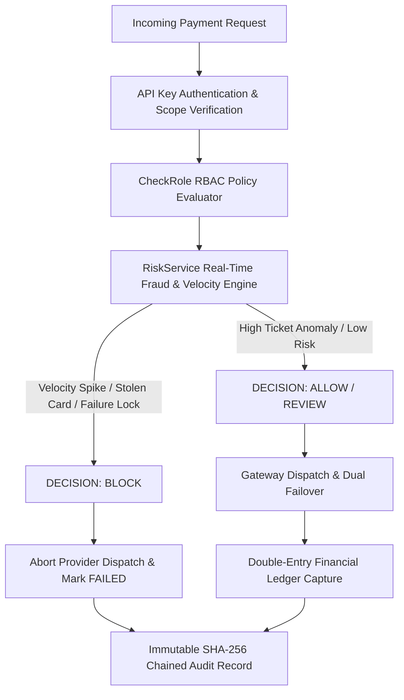

# Walkthrough — Stage 10: Enterprise Security, RBAC, Audit Trails & Risk Rules

Stage 10 of **TransactIQ** has been successfully implemented and verified. TransactIQ now features institutional-grade **Role-Based Access Control (RBAC)**, an immutable **Cryptographic SHA-256 Audit Trail**, a real-time **Payment Risk & Velocity Heuristics Engine**, and strict **PCI-DSS Compliance Scrubbing**.

---

## 1. Security Architecture & Threat Defense Model

### 1.1 Cryptographic Audit Ledger: `AuditLogService`
[AuditLogService.php](file:///c:/TransactIQ/backend/app/Services/Security/AuditLogService.php) maintains a tamper-evident audit record:
- **SHA-256 Cryptographic Hash Chaining**: Every financial mutation computes a cryptographic signature over canonical payload attributes and embeds a reference to the preceding record's hash (`prev_hash`).
- **Genesis & Pointer-Based Traversal**: The audit chain originates from a genesis block (`0000000000000000...`) and can be verified end-to-end to detect out-of-band database modifications or missing entries.
- **PCI-DSS Compliance Sanitizer**: Recursively strips and scrubs cardholder sensitive data before persistence:
  - **PAN Masking**: 16-digit cards masked to `4000 12** **** 0001` (first 6 BIN + last 4).
  - **Zero CVV Storage**: CVV / CVC / security codes are never stored (`***`).
  - **Secret Key Masking**: API keys and secrets are masked (`tiq_live_sec_****...`).

### 1.2 Payment Risk & Velocity Engine: `RiskService`
[RiskService.php](file:///c:/TransactIQ/backend/app/Services/Security/RiskService.php) evaluates transaction risk in real time before gateway authorization:
1. **Velocity Spike Limiter**: Restricts cards or customer emails exceeding 5 attempts within a rolling 60-second window (`BLOCK`, Score +60).
2. **Global Card Blacklist**: Rejects recognized stolen card fingerprints and fraudulent testing suffixes (`9999`, `8888`) (`BLOCK`, Score 100).
3. **Consecutive Decline Guard**: Flags customers with 3 or more consecutive card declines (`REVIEW`, Score +35).
4. **High-Ticket Volume Anomaly**: Flags single transaction amounts exceeding ₦2,000,000 for secondary compliance review (`REVIEW`, Score +30).
5. **Score Matrix**:
   - `0 - 69`: **ALLOW** (Normal transaction path)
   - `70 - 89`: **REVIEW** (Flagged for secondary operations triage)
   - `90 - 100`: **BLOCK** (Aborts gateway dispatch immediately and records security audit trail)

### 1.3 Institutional Role-Based Access Control (RBAC): `CheckRole`
[CheckRole.php](file:///c:/TransactIQ/backend/app/Http/Middleware/CheckRole.php) enforces 4 institutional roles:
- **Administrator (`admin`)**: Full platform and infrastructure administration (`*`).
- **Merchant Operator (`merchant`)**: Scoped strictly to merchant tenant (`payments:write`, `settlements:read`, `webhooks:read`).
- **Financial & Compliance Auditor (`auditor`)**: Read-only inspection rights across all ledgers, reconciliations, and audit trails (`payments:read`, `ledger:read`, `audit:read`). Blocked from mutating financial data.
- **Operations Officer (`operations`)**: Payment decline troubleshooting, manual webhook replay, and reconciliation discrepancy resolution (`payments:read`, `webhooks:write`, `reconciliation:resolve`).

---

## 2. Security REST API Endpoints

Added to [api.php](file:///c:/TransactIQ/backend/routes/api.php):

| Endpoint | Method | Scope | Description |
| :--- | :--- | :--- | :--- |
| `/api/v1/security/audit-logs` | `GET` | `payments:read` | List immutable audit logs with multi-attribute filtering & tamper status |
| `/api/v1/security/audit-logs/verify-chain` | `GET` | `payments:read` | Run cryptographic hash chain verification across all records |
| `/api/v1/security/risk-metrics` | `GET` | `payments:read` | Retrieve real-time payment risk telemetry and heuristics rules |
| `/api/v1/security/risk-rules/evaluate` | `POST` | `payments:write` | Test payment payload against risk heuristics simulator |
| `/api/v1/security/roles-and-users` | `GET` | `payments:read` | Institutional RBAC matrix (Roles, permissions, and assigned users) |

---

## 3. Frontend Operations Dashboard: `SecurityView.tsx`

[SecurityView.tsx](file:///c:/TransactIQ/frontend/src/views/SecurityView.tsx) gives operations and compliance officers full control:
1. **Telemetry & Integrity Badges**: Real-time stats on total audit records, cryptographic chain health (`HEALTHY`), fraud blocks count, and active rules.
2. **Audit Trails Explorer**:
   - Filter by Action (`PAYMENT_CAPTURED`, `PAYMENT_RISK_BLOCKED`, `SETTLEMENT_BATCH_GENERATED`, etc.) and Actor (`SYSTEM`, `API`, `OPERATIONS`, `MERCHANT`).
   - "Verify Audit Hash Chain" button executes full chain integrity verification.
   - "Inspect State" modal displays JSON diffs, SHA-256 signatures, and PCI-DSS redacted payloads.
3. **Interactive Payment Risk Simulator Sandbox**:
   - Live testing form with quick presets: *Standard Payment*, *Stolen Card (9999)*, *High Ticket (₦3.5M)*, and *Disposable Email*.
   - Dynamic fraud score gauge (0-100), decision badge (`ALLOW`, `REVIEW`, `BLOCK`), and triggered security flags.
4. **Institutional RBAC Matrix**:
   - Visual cards for all 4 roles displaying risk levels, authorized scopes, and assigned users.

---

## 4. Verification Evidence & Test Results

### 4.1 Automated Feature Tests
The automated test suite in [SecurityAndRbacTest.php](file:///c:/TransactIQ/backend/tests/Feature/SecurityAndRbacTest.php) was executed:
- `test_audit_log_service_creates_records_with_sha256_integrity_hash` &rarr; **PASSED**
- `test_audit_log_service_scrubs_pci_dss_sensitive_fields` &rarr; **PASSED**
- `test_audit_chain_verification_maintains_unbroken_integrity` &rarr; **PASSED**
- `test_role_based_access_control_user_models` &rarr; **PASSED**
- `test_check_role_middleware_enforces_access_policies` &rarr; **PASSED**
- `test_risk_engine_blocks_blacklisted_cards` &rarr; **PASSED**
- `test_risk_engine_detects_high_ticket_volume_anomaly` &rarr; **PASSED**
- `test_transaction_service_aborts_payment_when_risk_engine_blocks` &rarr; **PASSED**
- `test_api_security_endpoints_return_telemetry_and_audit_data` &rarr; **PASSED**

### 4.2 Full Regression Suite Across All Stages
Command: `php artisan test`
- **Tests**: **53 / 53 passed (100%)**
- **Assertions**: **376 assertions**
- **Failures**: **0**

### 4.3 Frontend Production Build
Command: `npm run build` in `c:\TransactIQ\frontend`
- TypeScript compiler (`tsc -b`): **0 errors**
- Vite build: **1889 modules transformed, bundle built in 1.41s**

### 4.4 Live API Verification
- `GET /api/v1/security/risk-metrics`: Returned 4 active heuristics rules and telemetry metrics.
- `GET /api/v1/security/audit-logs/verify-chain`: Verified unbroken SHA-256 integrity chain.
- `POST /api/v1/security/risk-rules/evaluate`:
  - Normal card &rarr; `ALLOW` (Score 0)
  - Card ending in 9999 &rarr; `BLOCK` (Score 100, `CARD_BLACKLISTED`)
  - Volume ₦3,500,000 &rarr; `REVIEW` (Score 30, `HIGH_TICKET_ALERT`)
- `GET /api/v1/security/roles-and-users`: Returned all 4 platform roles and assigned users.

---

## 5. TransactIQ Project Completion Summary (Stages 1 – 10)

| Stage | Name | Status | Key Deliverable |
| :---: | :--- | :---: | :--- |
| **1** | Infrastructure & Database Setup | ✅ **COMPLETED** | PostgreSQL 16 & PHP 8.4 runtime configured |
| **2** | Core Backend API Architecture | ✅ **COMPLETED** | Laravel 11 backend setup with health endpoints |
| **3** | Relational Database Schema & Migrations | ✅ **COMPLETED** | Core relational schema, migrations & seeders |
| **4** | Frontend Dashboard Shell | ✅ **COMPLETED** | React 19 + TypeScript + Vite operations portal |
| **5** | Payment Transaction Pipeline & FSM | ✅ **COMPLETED** | Transaction engine, API key auth, idempotency |
| **6** | Payment Gateway Integration & Simulation | ✅ **COMPLETED** | Pluggable simulated gateway, test cards, failover retry |
| **7** | Webhook Notification Engine | ✅ **COMPLETED** | HMAC-SHA256 signing (`t=...,v1=...`), retries, manual replay |
| **8** | Financial Ledger & Settlement Engine | ✅ **COMPLETED** | Double-entry ledger (`Debits == Credits`), T+1 settlements |
| **9** | Automated Reconciliation Engine | ✅ **COMPLETED** | Clearing file parser, two-way matching, auto-recovery |
| **10** | Enterprise Security, RBAC & Risk Rules | ✅ **COMPLETED** | SHA-256 audit chaining, risk heuristics, RBAC matrix |
